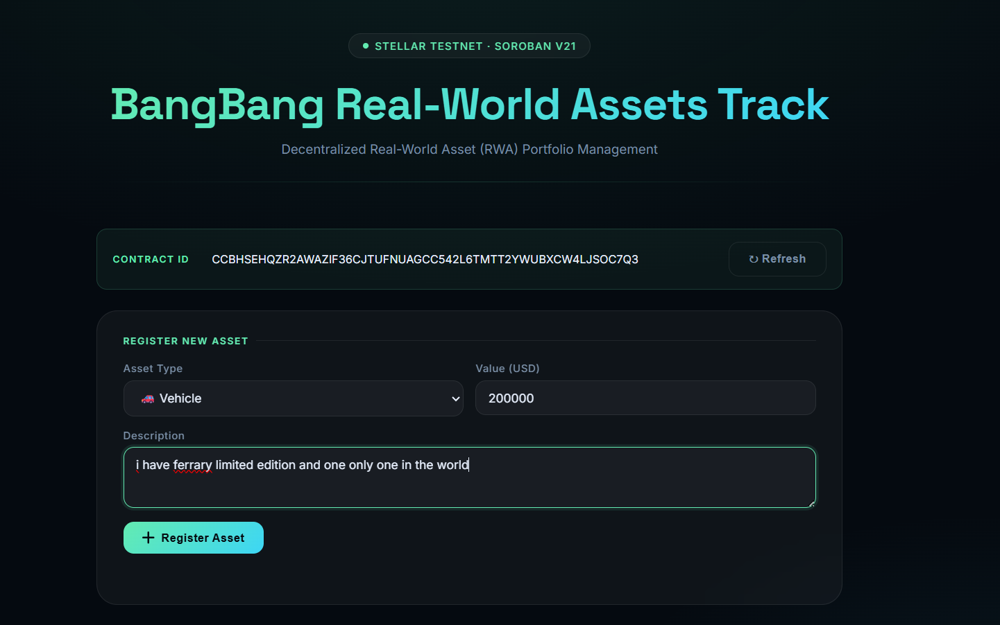
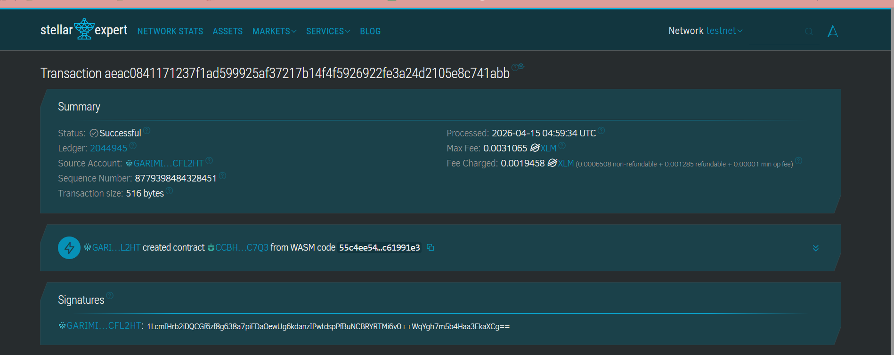

# Bang Bang — Real World Asset (RWA) Protocol

**Bang Bang** is a decentralized protocol built on the **Stellar Network** using **Soroban Smart Contracts**. It is designed to record, validate, and manage physical asset portfolios—such as gold, land, properties, and vehicles—by transforming real-world assets into structured on-chain data.

---

## 🚀 Features
- **Create (Register) Asset**: Seamlessly register new physical assets onto the blockchain with detailed metadata including type, description, and appraised value.
- **Read (Get) Assets**: Retrieve and monitor your entire asset portfolio directly from the ledger in real-time.
- **Delete Asset**: Securely remove asset records from the protocol when they are no longer part of the portfolio.

---

## 🛠️ Technical Details

- **Blockchain**: Stellar (Testnet)
- **Smart Contract Engine**: Soroban
- **Language**: Rust
- **Smart Contract ID**: `CCBHSEHQZR2AWAZIF36CJTUFNUAGCC542L6TMTT2YWUBXCW4LJSOC7Q3`

---

## 📸 Screenshots

### Frontend Interface

*Modern minimalist dashboard with glassmorphism design for asset management.*

### On-Chain Transaction (Stellar Expert)

*Successful contract deployment and transaction validation on Stellar Expert.*

---

## 📂 Project Structure
- `/contracts`: Contains the Soroban smart contract source code in Rust.
- `/frontend`: The web interface to interact with the protocol.
- `/images`: Screenshots for documentation.

---

## 📜 How to Run
1. **Build Contract**: `stellar contract build`
2. **Deploy**: `stellar contract deploy --wasm target/wasm32v1-none/release/bangbang.wasm --source lang --network testnet`
3. **Frontend**: Open `index.html` or run `npm run dev` in the frontend directory.

---
*Built as part of the "Rise in Stellar" Workshop at Telkom University.*